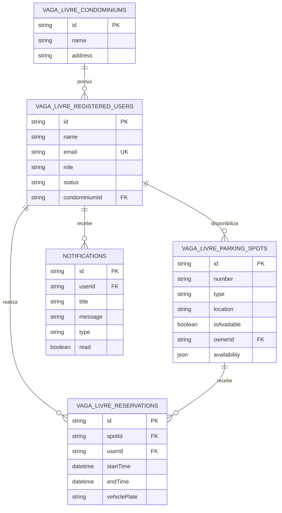
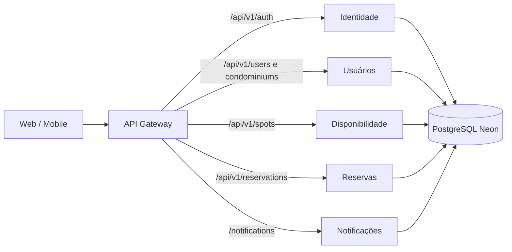
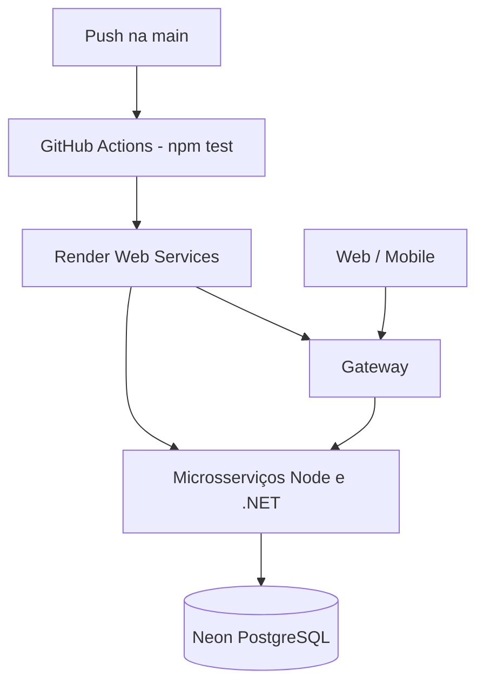

# ⚙️ Etapa 2: APIs, Web Services e Persistência de Dados Distribuída

Este documento reúne as evidências de engenharia do backend distribuído do **VagaLivre**. O código correspondente está em [`src/backend/`](./).

---

## 🎯 Rubricas de Avaliação desta Etapa

1. **H34a** — Gerenciar e documentar serviços de TI (código em `src/backend/`).
2. **H35b** — Arquitetura distribuída e modelagem de dados (seção 2).
3. **H35c** — Implantação, conteinerização e DevOps (seção 5).
4. **H36a** — Documentação de contratos das APIs (seção 3).
5. **H36b** — Implementação dos endpoints (código em `src/backend/`).
6. **H36c** — Testes automatizados das APIs (seção 4).

---

## 📅 QUADRO DE CONTRIBUIÇÃO REAL (ETAPA 2)

- **Status admitidos**: `⌛ Não Iniciado` | `📝 Em Progresso` | `✔️ Entregue`

| Rubrica | ID | Atividade | Tarefa | Estudante | GitHub | Status | Evidência |
| :---: | :---: | :---: | :--- | :--- | :---: | :---: | :--- |
| **H36b** | `T2.1` | `ATV2.1` | Boilerplate, roteamento e inicialização das APIs Node | Allan Viana | `AllanAviana` | `✔️ Entregue` | [`src/backend/`](./) |
| **H36b** | `T2.2` | `ATV2.1` | Modelagem e persistência (Prisma, Neon, schema) | Andre Lopes | `dezim005` | `✔️ Entregue` | [Seção 2.1](#21-schema-e-diagrama-entidade-relacionamento) |
| **H36b** | `T2.3` | `ATV2.1` | Endpoints CRUD e lógica de negócio | Giovanny Lisboa | `glisboapuc` | `✔️ Entregue` | [Seção 3](#3-especificacao-avancada-de-endpoints) |
| **H36b** | `T2.4` | `ATV2.1` | Segurança da API (token HMAC, perfis, CORS) | Gustavo Veloso | `gust_2003` | `✔️ Entregue` | [Seção 3.3](#33-seguranca-e-autorizacao) |
| **H35b** | `T2.5` | `ATV2.1` | API Gateway e integração dos microsserviços | Roberta Alves Lima | `RobertaAlvesLima` | `✔️ Entregue` | [Seção 2.2](#22-integracao-e-infraestrutura-distribuida) |
| **H36c** | `T2.6` | `ATV2.2` | Testes automatizados (Vitest + Supertest) | Allan Viana | `AllanAviana` | `✔️ Entregue` | [Seção 4](#4-estrategia-e-relatorio-de-testes-automatizados) |
| **H35c** | `T2.7` | `ATV2.1` | Dockerfile e docker-compose | Giovanny Lisboa | `glisboapuc` | `✔️ Entregue` | [Seção 5.1](#51-conteinerizacao-de-servicos) |
| **H36c** | `T2.8` | `ATV2.2` | Proposta de deploy e CI/CD | Pedro Cassimiro | `pedroh-corr` | `✔️ Entregue` | [Seção 5.2](#52-proposta-de-infraestrutura-de-deploy-e-ambiente-em-producao) |

---

# 1. Escopo e Objetivos do Backend

O backend do **VagaLivre** oferece APIs REST para o compartilhamento de vagas em condomínios: cadastro de moradores e síndicos, autenticação, consulta de disponibilidade, reservas e notificações.

Em produção o cliente (web ou mobile) utiliza uma **porta única**, o API Gateway. O gateway encaminha o caminho completo da requisição ao microsserviço responsável.

### Microsserviços

| Serviço | Pasta | Responsável | Função |
| :--- | :--- | :--- | :--- |
| Gateway | [`gateway/`](./gateway/) | Roberta | Porta única HTTP |
| Identidade | [`pedro/`](./pedro/) | Pedro | Login, token de sessão e `/auth/me` |
| Usuários e condomínios | [`roberta/`](./roberta/) | Roberta | Cadastro, aprovação e CRUD |
| Disponibilidade | [`allan/`](./allan/) | Allan | Listagem e filtros de vagas |
| Reservas | [`gustavo/`](./gustavo/) | Gustavo | Criação, consulta e cancelamento |
| Notificações | [`andre/`](./andre/) | André | Histórico de avisos e e-mail transacional |
| Vagas (.NET) | [`giovanny/`](./giovanny/) | Giovanny | CRUD HATEOAS de vagas em ASP.NET Core |

### Stack técnica

- **APIs JS/TS:** Node.js, Express, Prisma 6, Vitest, Supertest
- **API .NET:** ASP.NET Core 8, Entity Framework Core, Swagger
- **Persistência:** PostgreSQL serverless na Neon (`vagaLivre*` + tabela `notifications`)
- **Integração:** API Gateway com `http-proxy-middleware`
- **Hospedagem:** Render (serviços HTTP) + Neon (banco)

O volume esperado é condominial (dezenas a centenas de moradores). O Neon gerencia o *pool* de conexões; o gateway usa timeout de 60 segundos para absorver o *cold start* dos serviços.

**Gateway em produção:** [https://gateway-api-d2uo.onrender.com](https://gateway-api-d2uo.onrender.com)

---

# 2. Modelagem da Aplicação e Arquitetura de Dados

*(Rubrica **H35b**)*

## 2.1. Schema e Diagrama Entidade-Relacionamento

O modelo lógico está no Prisma ([`allan/schema.prisma`](./allan/schema.prisma) e equivalentes nas demais APIs Node). As tabelas físicas no Neon seguem o prefixo `vagaLivre`.

| Tabela | Chave | Relacionamentos | Observação |
| :--- | :--- | :--- | :--- |
| `vagaLivreCondominiums` | `id` | 1:N usuários | Nome e endereço do condomínio |
| `vagaLivreRegisteredUsers` | `id` (e-mail único) | N:1 condomínio; 1:N vagas e reservas | Papéis `resident` / `manager`; status `pending` / `approved` / `denied` |
| `vagaLivreParkingSpots` | `id` | N:1 dono; 1:N reservas | Tipos `compact`, `standard`, `suv`, `motorcycle`; disponibilidade em JSON |
| `vagaLivreReservations` | `id` | N:1 vaga e N:1 usuário | `startTime` / `endTime` em `timestamptz` |
| `notifications` | `id` | N:1 usuário | Histórico da API de avisos (André) |

Diagrama ER (renderizado pelo GitHub via [Mermaid](https://docs.github.com/en/get-started/writing-on-github/working-with-advanced-formatting/creating-diagrams)):


```mermaid
erDiagram
    VAGA_LIVRE_CONDOMINIUMS ||--o{ VAGA_LIVRE_REGISTERED_USERS : possui
    VAGA_LIVRE_REGISTERED_USERS ||--o{ VAGA_LIVRE_PARKING_SPOTS : disponibiliza
    VAGA_LIVRE_REGISTERED_USERS ||--o{ VAGA_LIVRE_RESERVATIONS : realiza
    VAGA_LIVRE_PARKING_SPOTS ||--o{ VAGA_LIVRE_RESERVATIONS : recebe
    VAGA_LIVRE_REGISTERED_USERS ||--o{ NOTIFICATIONS : recebe

    VAGA_LIVRE_CONDOMINIUMS {
        string id PK
        string name
        string address
    }
    VAGA_LIVRE_REGISTERED_USERS {
        string id PK
        string name
        string email UK
        string role
        string status
        string condominiumId FK
    }
    VAGA_LIVRE_PARKING_SPOTS {
        string id PK
        string number
        string type
        string location
        boolean isAvailable
        string ownerId FK
        json availability
    }
    VAGA_LIVRE_RESERVATIONS {
        string id PK
        string spotId FK
        string userId FK
        datetime startTime
        datetime endTime
        string vehiclePlate
    }
    NOTIFICATIONS {
        string id PK
        string userId FK
        string title
        string message
        string type
        boolean read
    }
```

Seed compartilhado para testes: [`seed.js`](./seed.js). Script da tabela de notificações: [`add-notifications.sql`](./add-notifications.sql).

## 2.2. Integração e Infraestrutura Distribuída

A solução é um conjunto de microsserviços HTTP independentes, orquestrados pelo gateway.


```mermaid
flowchart LR
    Front[Web / Mobile] --> GW[API Gateway]
    GW -->|/api/v1/auth| Pedro[Identidade]
    GW -->|/api/v1/users e condominiums| Roberta[Usuários]
    GW -->|/api/v1/spots| Allan[Disponibilidade]
    GW -->|/api/v1/reservations| Gustavo[Reservas]
    GW -->|/notifications| Andre[Notificações]
    Pedro --> Neon[(PostgreSQL Neon)]
    Roberta --> Neon
    Allan --> Neon
    Gustavo --> Neon
    Andre --> Neon
```

- **Síncrono:** o gateway faz proxy HTTP e devolve a resposta do serviço de destino, preservando o pathname (`/api/v1/spots`, `/api/v1/auth`, etc.).
- **Concorrência:** Prisma Client + *connection pooling* serverless da Neon.
- **Resiliência:** timeout de 60s no proxy; em falha de *upstream* o gateway responde `502`.
- **Assíncrono pontual:** o serviço de notificações grava o aviso no banco e dispara e-mail via Resend em segundo plano.

Rotas do gateway ([`gateway/server.js`](./gateway/server.js)):

| Prefixo | Destino |
| :--- | :--- |
| `/api/v1/auth` | API do Pedro |
| `/api/v1/users` e `/api/v1/condominiums` | API da Roberta |
| `/api/v1/spots` | API do Allan |
| `/api/v1/reservations` | API do Gustavo |
| `/notifications` | API do André |
| `/api/ParkingSpots` | API .NET do Giovanny (quando `GIOVANNY_API` está configurada) |

---

# 3. Especificação Avançada de Endpoints

*(Rubrica **H36b**)*

Contratos implementados em `src/backend/`. Em produção, o prefixo público é o gateway.

## 3.1. Relação Geral de Endpoints

| Método | Caminho | Descrição | Controle de acesso | Responsável |
| :---: | :--- | :--- | :--- | :--- |
| `GET` | `/health` | Saúde do serviço / do gateway | Público | Equipe |
| `POST` | `/api/v1/auth/login` | Autentica morador/síndico e emite token HMAC | Público (credenciais) | Pedro |
| `GET` | `/api/v1/auth/me` | Recupera o usuário da sessão | Token HMAC (Bearer) | Pedro |
| `POST` | `/api/v1/auth/logout` | Encerra a sessão no cliente | Sessão | Pedro |
| `GET` | `/api/v1/condominiums` | Lista condomínios | Consulta autenticável | Roberta |
| `GET` | `/api/v1/condominiums/:id` | Busca condomínio | Consulta autenticável | Roberta |
| `POST` | `/api/v1/condominiums` | Cadastra condomínio | Síndico / operação administrativa | Roberta |
| `GET` | `/api/v1/users` | Lista usuários (filtros `status`, `condominiumId`) | Síndico / operação administrativa | Roberta |
| `GET` | `/api/v1/users/:id` | Busca usuário | Identidade do recurso | Roberta |
| `POST` | `/api/v1/users` | Cadastro (primeiro usuário = síndico aprovado) | Público (onboarding) | Roberta |
| `PATCH` | `/api/v1/users/:id` | Atualiza perfil ou status (`approved` / `denied`) | Síndico / dono do perfil | Roberta |
| `DELETE` | `/api/v1/users/:id` | Remove usuário | Operação administrativa | Roberta |
| `GET` | `/api/v1/spots` | Lista vagas (`q`, `type`, `status`, `date`, `ownerId`) | Consulta autenticável | Allan |
| `GET` | `/api/v1/spots/:id` | Detalhe da vaga | Consulta autenticável | Allan |
| `GET` | `/api/v1/reservations` | Lista reservas (`userId`, `spotId`) | Identidade do morador | Gustavo |
| `GET` | `/api/v1/reservations/:id` | Detalhe da reserva | Identidade do recurso | Gustavo |
| `POST` | `/api/v1/reservations` | Cria reserva (valida disponibilidade e conflito) | Identidade do morador (`userId`) | Gustavo |
| `DELETE` | `/api/v1/reservations/:id` | Cancela reserva | Autorização do dono (`userId`) | Gustavo |
| `GET` | `/notifications/user/:userId` | Histórico de avisos do morador | Identidade do morador | André |
| `POST` | `/notifications` | Registra aviso e envia e-mail | Operação de domínio | André |
| `PATCH` | `/notifications/:id/read` | Marca aviso como lido | Identidade do recurso | André |
| `DELETE` | `/notifications/:id` | Remove aviso | Identidade do recurso | André |
| `GET` `POST` `PUT` `DELETE` | `/api/ParkingSpots` | CRUD HATEOAS de vagas (.NET) | Recurso de vaga | Giovanny |

## 3.2. Detalhamento dos Payloads

### `POST /api/v1/auth/login`

- **Headers:** `Content-Type: application/json`
- **Entrada:**

```json
{
  "email": "teste@vagalivre.com",
  "password": "123456"
}
```

- **Sucesso (`200`):**

```json
{
  "message": "Login realizado com sucesso.",
  "data": {
    "token": "eyJ...assinaturaHMAC",
    "user": {
      "id": "user-demo",
      "name": "Morador Teste",
      "email": "teste@vagalivre.com",
      "role": "resident",
      "status": "approved"
    }
  }
}
```

- **Erros:** `400` campos obrigatórios; `401` credenciais inválidas; `403` conta pendente ou negada pelo síndico; `500` falha interna.

### `GET /api/v1/auth/me`

- **Headers:** `Authorization: Bearer <token>`
- **Sucesso (`200`):** `{ "data": { "id", "name", "email", "role", "status", ... } }`
- **Erros:** `401` token inválido, expirado ou usuário sem sessão aprovada.

### `GET /api/v1/spots`

- **Query:** `q`, `type` (`compact` \| `standard` \| `suv` \| `motorcycle`), `status` (`all` \| `available` \| `occupied`), `date` (`YYYY-MM-DD`), `ownerId`
- **Sucesso (`200`):**

```json
{
  "data": [
    {
      "id": "spot-demo",
      "number": "A-01",
      "type": "standard",
      "location": "Subsolo 1",
      "isAvailable": true,
      "ownerId": "user-demo",
      "availability": [],
      "reservations": []
    }
  ]
}
```

- **Erros:** `400` filtro inválido; `404` no `GET /api/v1/spots/:id`; `500` falha de consulta.

### `POST /api/v1/reservations`

- **Entrada:**

```json
{
  "spotId": "spot-demo",
  "userId": "user-demo",
  "startTime": "2026-10-08",
  "endTime": "2026-10-10",
  "vehiclePlate": "XYZ-9A87"
}
```

- **Sucesso (`201`):** `{ "message": "Vaga reservada com sucesso!", "data": { "id", "spotId", "userId", "startTime", "endTime", "vehiclePlate" } }`
- **Erros:** `400` período inválido ou fora da disponibilidade do dono; `404` usuário ou vaga; `409` conflito de agenda; `403` no cancelamento por outro morador.

### `POST /api/v1/users`

- **Entrada:** `{ "name", "email", "password", "condominiumId" }`
- **Sucesso (`201`):** usuário criado (primeiro cadastro vira síndico `approved`; demais ficam `pending` para o síndico).
- **Erros:** `400` campos ausentes; `404` condomínio; `409` e-mail duplicado.

## 3.3. Segurança e Autorização

A segurança do canal combina quatro camadas:

1. **CORS** habilitado nas APIs para os clientes web e mobile.
2. **Segredos fora do repositório:** `DATABASE_URL`, `JWT_SECRET` e credenciais de e-mail ficam nas variáveis de ambiente do Render. `.env` está no `.gitignore`.
3. **Token de sessão (HMAC-SHA256):** o serviço de identidade assina um payload `{ id, email, role, exp }` com `crypto.createHmac("sha256", JWT_SECRET)`. O cliente envia `Authorization: Bearer <token>`. A validade é de **24 horas**. A rota `GET /api/v1/auth/me` valida assinatura, expiração e status `approved`.
4. **RBAC de domínio:**
   - `manager` (síndico) — aprova ou nega cadastros (`PATCH` de `status`)
   - `resident` (morador) — consulta vagas e reserva
   - login somente com conta `approved`
   - cancelamento de reserva somente pelo `userId` dono (`403` caso contrário)

---

# 4. Estratégia e Relatório de Testes Automatizados

*(Rubrica **H36c**)*

A equipe testa cada microsserviço **localmente**, com **Vitest** e **Supertest**. O Prisma é mockado: a suíte não depende do Neon nem de credenciais. Os casos cobrem fluxo de sucesso e caminhos de exceção.

1. **Ferramenta:** Vitest + Supertest  
2. **Comando** (na pasta do serviço):

```bash
cd src/backend/allan    && npm test
cd src/backend/pedro    && npm test
cd src/backend/roberta  && npm test
cd src/backend/gustavo  && npm test
cd src/backend/andre    && npm test
```

No PowerShell, se `npm.ps1` estiver bloqueado:

```powershell
Set-ExecutionPolicy -Scope Process Bypass
npm test
```

3. **Resultado local da suíte:** 11 (Allan) + 12 (Pedro) + 23 (Roberta) + 16 (Gustavo) + 7 (André).

| Módulo | Tipo | Cenários avaliados | Status |
| :--- | :--- | :--- | :---: |
| Disponibilidade — [`allan/tests/spots.spec.js`](./allan/tests/spots.spec.js) | Integração (DB mockado) | Health, listagem, filtros, validação `400`, detalhe `200`/`404`, falha `500` | ✔️ Passou (11) |
| Autenticação — [`pedro/tests/auth.spec.js`](./pedro/tests/auth.spec.js) | Integração (DB mockado) | Login com credenciais, pendente, negado, token, `/me`, logout, falha `500` | ✔️ Passou (12) |
| Usuários e condomínios — [`roberta/tests/users.spec.js`](./roberta/tests/users.spec.js) | Integração (DB mockado) | CRUD, primeiro síndico, morador pendente, e-mail duplicado, status inválido | ✔️ Passou (23) |
| Reservas — [`gustavo/tests/reservations.spec.js`](./gustavo/tests/reservations.spec.js) | Integração (DB mockado) | Criação, conflito `409`, disponibilidade, cancelamento pelo dono | ✔️ Passou (16) |
| Notificações — [`andre/tests/`](./andre/tests/) | Unitário + integração (DB e e-mail mockados) | POST, GET, PATCH, DELETE e validação de campos | ✔️ Passou (7) |

O gateway publicado em [https://gateway-api-d2uo.onrender.com/api/v1/spots](https://gateway-api-d2uo.onrender.com/api/v1/spots) confirma a integração ponta a ponta com o Neon após o deploy.

---

# 5. Instruções de Implantação e DevOps

*(Rubrica **H35c**)*

## 5.1. Conteinerização de Serviços

A API .NET de vagas é empacotada com Docker para execução local auto-contida (API + PostgreSQL na mesma rede):

- Dockerfile: [`giovanny/Dockerfile`](./giovanny/Dockerfile)
- Compose: [`giovanny/docker-compose.yml`](./giovanny/docker-compose.yml)

```bash
cd src/backend/giovanny
docker compose up --build
```

- API: `http://localhost:8080`
- Swagger: `http://localhost:8080/swagger`

As APIs Node sobem com `npm start` em cada pasta (`node server.js` ou `npx tsx server.ts` no André) e compartilham o mesmo `DATABASE_URL` da Neon.

## 5.2. Proposta de Infraestrutura de Deploy e Ambiente em Produção

**Modelo de CI/CD:** a cada *push* ou *pull request* na `main`, o GitHub Actions executa `npm test` nas pastas `allan`, `pedro`, `roberta`, `gustavo` e `andre`. O merge segue com a suíte verde. O Render faz o deploy automático a partir da `main`, com o *root directory* apontando para a pasta de cada microsserviço.

**Arquitetura física:**


```mermaid
flowchart TB
    Dev[Push na main] --> GHA[GitHub Actions - npm test]
    GHA --> Render[Render Web Services]
    Render --> GW[Gateway]
    Render --> APIs[Microsserviços Node e .NET]
    APIs --> Neon[(Neon PostgreSQL)]
    Client[Web / Mobile] --> GW
    GW --> APIs
```

- **HTTP:** um Web Service Render por API + o gateway como host público dos fronts
- **Dados:** Neon (Postgres + pooler)
- **Segredos:** painel do Render (`DATABASE_URL`, `JWT_SECRET`, `ALLAN_API`, `GUSTAVO_API`, `PEDRO_API`, `ROBERTA_API`, `ANDRE_API`)

| Serviço | URL |
| :--- | :--- |
| Gateway | [https://gateway-api-d2uo.onrender.com](https://gateway-api-d2uo.onrender.com) |
| Disponibilidade | [https://vaga-livre-api.onrender.com](https://vaga-livre-api.onrender.com) |
| Reservas | [https://gusstavo-api.onrender.com](https://gusstavo-api.onrender.com) |
| Identidade | [https://pmv-si-2026-2-pe6-t2-g09-1.onrender.com](https://pmv-si-2026-2-pe6-t2-g09-1.onrender.com) |
| Usuários | [https://pmv-si-2026-2-pe6-t2-g09-1-jbk9.onrender.com](https://pmv-si-2026-2-pe6-t2-g09-1-jbk9.onrender.com) |
| Notificações | [https://andre-api-bhnv.onrender.com](https://andre-api-bhnv.onrender.com) |

---

# 6. Referências Acadêmicas e de Engenharia

1. DATE, C. J. *Introdução a Sistemas de Bancos de Dados*. Rio de Janeiro: Elsevier, 2004.
2. RICHARDSON, Leonard; RUBY, Sam. *RESTful Web Services*. Sebastopol: O’Reilly Media, 2007.
3. Prisma. *Prisma Client — PostgreSQL*. <https://www.prisma.io/docs>
4. Neon. *Serverless Postgres*. <https://neon.tech/docs>
5. Express. *API reference*. <https://expressjs.com>
6. Vitest. *Documentation*. <https://vitest.dev>
7. GitHub. *Creating diagrams (Mermaid)*. <https://docs.github.com/en/get-started/writing-on-github/working-with-advanced-formatting/creating-diagrams>
8. http-proxy-middleware. <https://github.com/chimurai/http-proxy-middleware>
9. Microsoft. *ASP.NET Core Web API*. <https://learn.microsoft.com/aspnet/core>
